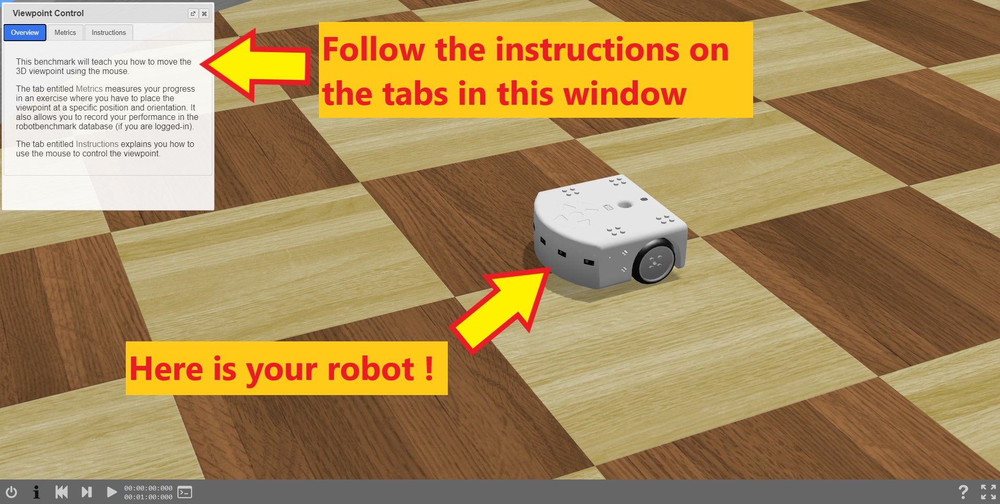
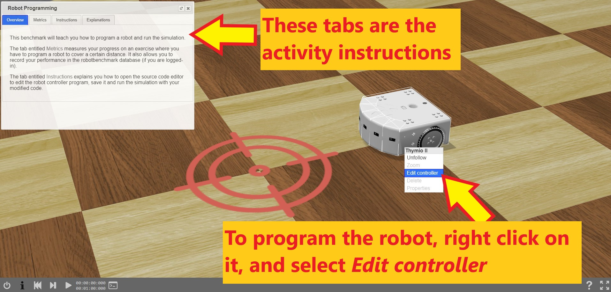
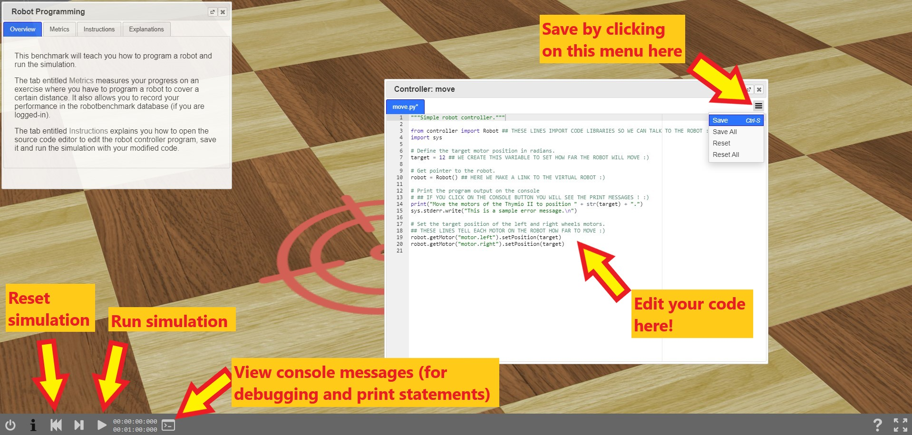
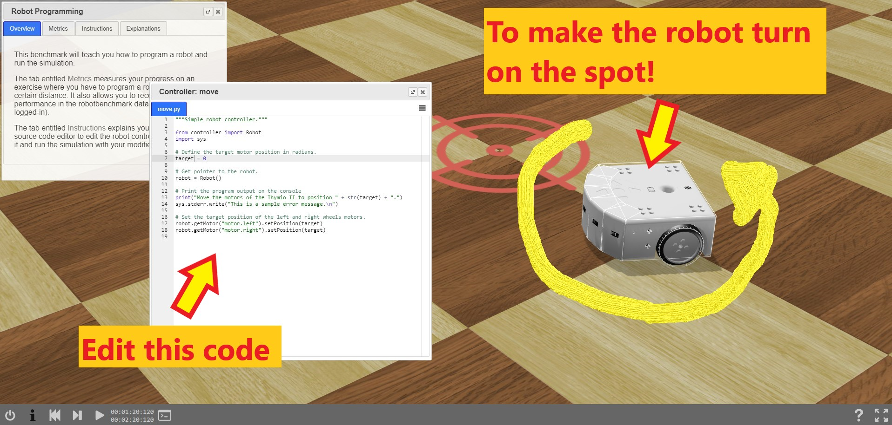
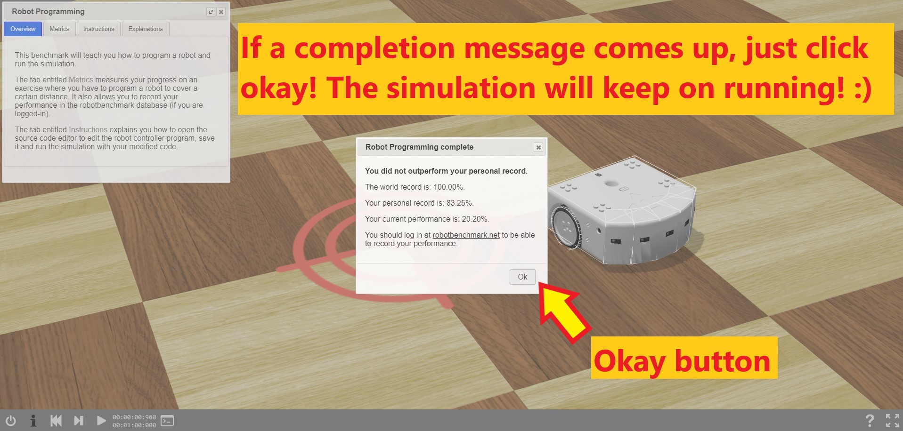

[](https://www.girlsintocoding.com/)

A project activity for [Girls Into Coding](https://www.girlsintocoding.com/) using a online version of the free open source [Webots](https://www.cyberbotics.com/) robot simulator.

This session is designed to be fun! The idea is that we can follow it together online, but that we can be free to move at our own pace. We're going to be doing some basic python programming in this activity. If you're not too familiar with Python, don't worry, you'll be able to follow along :) ! 

<!--Comment: Paragrpah spacing-->
<br>
<br>

<div class="container p-3 my-3 bg-primary">
<h2>Contents</h2>
<ul class="list-group">
  <li class="list-group-item"><a href="#resourcesPanel">Resources</a></li>
  <li class="list-group-item"><a href="#Activity1">What is a robot simulator?</a></li>
  <li class="list-group-item"><a href="#ActivitySim">Why simulate robots?</a></li>
  <li class="list-group-item"><a href="#Activity2">First steps using the robot simulator</a></li>
  <li class="list-group-item"><a href="#Activity3">Programming the robot!</a></li>
  <li class="list-group-item"><a href="#Activity4">Making the robot turn on the spot (creating a new python variable)</a></li>
  <li class="list-group-item"><a href="#Activity5">Working with python functions</a></li>
  <li class="list-group-item"><a href="#Activity6">Using python loops to make shapes with the robot!</a></li>
  <li class="list-group-item"><a href="#Activity7">Putting our code to make shapes into python functions!</a></li>
</ul>
</div>

<div id="resourcesPanel" class="container p-3 my-3 bg-info">
<h2>Resources</h2> 
  <p>Here's some resources that may help with the activity</p>
<ul class="list-group">
  <a href="https://www.w3schools.com/python/" target="_blank" class="list-group-item list-group-item-action">Python tutorials at W3 Schools</a>
  <a href="https://www.pythoncheatsheet.org/" target="_blank" class="list-group-item list-group-item-action">Python cheatsheet</a>
  <a href="https://www.cyberbotics.com/doc/reference/index" target="_blank" class="list-group-item list-group-item-action">Webots documentation</a>
  <a href="https://robohub.org/30-women-in-robotics-you-need-to-know-about-2019/" target="_blank" class="list-group-item list-group-item-action">30 women in robotics you need to know about – 2019</a>
</ul>
</div>

<!--Comment: Paragrpah spacing-->
<br>
<br>

# What is a robot simulator?
---
A robot simulator is like a video game, with robots in it! It's a very realistic version of the world, with one or more virtual robots inside. Let's try it out !! 

<div id="Activity1" class="container p-3 my-3 bg-primary text-primary">
<h2>Activity #1</h2>
</div>

We're going to be using [robotbenchmark](https://robotbenchmark.net/) in this activity, which is a online version of the 'Webots' simulator. 

* Navigate there in your browser now, by clicking this [link](https://robotbenchmark.net/).
* Click on the start button next to the **pick and place** activity.
* You will see a simulation running already, in the top right hand corner of the screen, try clicking on it to change the view.

<p class="text-primary"><b>Left click:</b> rotate   <b>Right click:</b> move</p>


You can click on any of the 'run' buttons to see someone else's attempt at coding the robot. 
* Try clicking on the run button next to Konstantina's record.
* Click on the 'play' button in the bottom left hand corner

<!--Comment: Paragrpah spacing-->
<br>
<br>

<div id="ActivitySim"></div>

# Why simulate robots?
---

Why would we want to simulate robots? .... Well because it's helpful for designing them. Let's take a look at this video.

[](https://youtu.be/xNKR2f1ov2s?t=97)

In the video you can see robotics professor Sabine Hauert talking about swarms of flying robots that she designed. The robots are tested in simulation!. If something is wrong with the software, and the robots crash :( it doesn't break the real robot! Sabine can just change the software and restart the simulation until the robots are flying well! Then the robotics team can try it on the real swarm of robots! [Here](https://www.youtube.com/watch?v=w2itwFJCgFQ) is another cool video of flying robots

<svg class="bi" width="32" height="32" fill="currentColor">
  <use xlink:href="bootstrap-icons.svg#heart-fill"/>
</svg>

<div class="container p-3 my-3 bg-info text-white">
<h2>Poll</h2>
<b>Question</b> As a future robot designer, what kind of robots will you prefer to build?
</div>

<!--Comment: Start of markdown poll-->
[](https://api.gh-polls.com/poll/01EEJ2P9FR88HJSQ80FQ9N4QZR/Social%20robots/vote)
[](https://api.gh-polls.com/poll/01EEJ2P9FR88HJSQ80FQ9N4QZR/Flying%20robots/vote)
[](https://api.gh-polls.com/poll/01EEJ2P9FR88HJSQ80FQ9N4QZR/Swarms%20of%20robots/vote)
[](https://api.gh-polls.com/poll/01EEJ2P9FR88HJSQ80FQ9N4QZR/Medical%20robots/vote)
[](https://api.gh-polls.com/poll/01EEJ2P9FR88HJSQ80FQ9N4QZR/Soft%20animal-like%20robots/vote)
[](https://api.gh-polls.com/poll/01EEJ2P9FR88HJSQ80FQ9N4QZR/Self%20driving%20robots/vote)
<!--Comment: End of markdown poll-->

<!--Comment: Paragrpah spacing-->
<br>
<br>

# First steps using the robot simulator
---
<div id="Activity2" class="container p-3 my-3 bg-primary text-primary">
<h2>Activity #2</h2>
</div>

* Let's return to the [robotbenchmark](https://robotbenchmark.net/) website.
* Click on the **Start** button next to the **Viewpoint Control** activity
* Click on **Start programming this benchmark**
* Follow the instructions in the top left hand corner of the screen
* When you have found the correct view click on the **record** button on the **metrics** tab



<!--Comment: Paragrpah spacing-->
<br>
<br>

# Programming the robot!
---

<div id="Activity3" class="container p-3 my-3 bg-primary text-primary">
<h2>Activity #3</h2>
</div>

* Let's return to the [robotbenchmark](https://robotbenchmark.net/) website.
* Click on the **Start** button next to the **Robot Programming** activity
* Click on **Start programming this benchmark**
* Read the instructions in the top left hand corner of the screen. You can resize the instruction window by dragging its bottom corner.
* When you're ready to program the robot, right click on it, and select **Edit controller**



* A window will pop up with python code in it! This is how we program our virtual robot.
* The same code is shown below with some comments which describe the purpose of each line

```python
"""Simple robot controller."""

from controller import Robot ## THESE LINES IMPORT CODE LIBRARIES SO WE CAN TALK TO THE ROBOT :)
import sys 

# Define the target motor position in radians.
target = 12 ## WE CREATE THIS VARIABLE TO SET HOW FAR THE ROBOT WILL MOVE :)

# Get pointer to the robot.
robot = Robot() ## HERE WE MAKE A LINK TO THE VIRTUAL ROBOT :)

# Print the program output on the console
# ## IF YOU CLICK ON THE CONSOLE BUTTON YOU WILL SEE THE PRINT MESSAGES ! :) 
print("Move the motors of the Thymio II to position " + str(target) + ".")
sys.stderr.write("This is a sample error message.\n")

# Set the target position of the left and right wheels motors.
## THESE LINES TELL EACH MOTOR ON THE ROBOT HOW FAR TO MOVE :)
robot.getMotor("motor.left").setPosition(target)
robot.getMotor("motor.right").setPosition(target)
```

* The instructions ask us to change the value of the variable **target**
* Go ahead and do this now
* Then save the python file by clicking on the **three bar icon**, and click **save**
* Now click on the **play button** to see your virtual robot run your program



* Try different values for the **target** variable. How about negative values, what does this do?
* When you want to change the program repeat the steps above
* To reset the simulation click on the **reset simulation** button

<!--Comment: Paragrpah spacing-->
<br>
<br>

# Making the robot turn on the spot (creating a new python variable)
---

<div id="Activity4" class="container p-3 my-3 bg-primary text-primary">
<h2>Activity #4</h2>
</div>

---
* We're still going to be using the [Robot Programming](https://robotbenchmark.net/benchmark/robot_programming/simulation.php) activity for this program!
* How do you think you would make the robot turn? So that it doesn't move in a straight line?
* Right click on the robot and select **Edit controller**
* Have a look at the code, is there a way you could make a different target for each motor by making a new variable?
* Give it a go ! if you get stuck you can take a look at the *example answer* :) 
* Don't worry if a completion message comes up, if you click on the **okay button** the simulation will keep running
* Follow the steps above to **save** your robot program and **reset** the simulation

<div class="container">
  <button type="button" class="btn btn-success" data-toggle="collapse" data-target="#demo0">Resources</button>
  <div id="demo0" class="collapse">
      
      <p><mark>Python variables explaination at <a href="https://www.w3schools.com/python/python_variables.asp">W3 schools :)</a></mark></p>
    
  </div>
</div>

<br>

<div class="container">
  <button type="button" class="btn btn-info" data-toggle="collapse" data-target="#demo4">Hint</button>
  <div id="demo4" class="collapse">
    
    <p><mark>Try making a new variable, so that you have a target position for each wheel!</mark></p>   
   
  </div>
</div>

<br>

<div class="container">
  <button type="button" class="btn btn-danger" data-toggle="collapse" data-target="#demo2">Example answer</button>
  <div id="demo2" class="collapse" markdown="1">
      
    """Simple robot controller."""

    ## This controller makes the robot turn on the spot!

    from controller import Robot
    import sys

    # Define the target for each motor position in radians.
    targetLeft = -100
    targetRight = 100

    # Get pointer to the robot.
    robot = Robot()

    # Print the program output on the console
    print("Move the left motor of the Thymio II to position " + str(targetLeft) + ".")
    print("Move the left motor of the Thymio II to position " + str(targetRight) + ".")
    sys.stderr.write("This is a sample error message.\n")

    # Set the target position of the left and right wheels motors.
    robot.getMotor("motor.left").setPosition(targetLeft)
    robot.getMotor("motor.right").setPosition(targetRight)    
    
  </div>
</div>
<br>






<!--Comment: Paragrpah spacing-->
<br>
<br>

# Working with python functions
---

<div id="Activity5" class="container p-3 my-3 bg-primary text-primary">
<h2>Activity #5</h2>
</div>

---
* We're still going to be using the [Robot Programming](https://robotbenchmark.net/benchmark/robot_programming/simulation.php) activity for this program!
* It would be nice to write a program so that we can just say to the robot *"turn left"* or *"go backwards for 2 seconds"*
* We can achieve this using **python functions** (this is also called functional programming). If you've not used python functions before, have a look at the resources!!
* Right click on the robot and select **Edit controller**
* Below is an example of some code with two functions: *stopRobot()* and *moveForwardsInStraightLine(numberofTimeSteps)*
* The *numberofTimeSteps* tell the robot how long to carry out that movement
* Have a look at the code, is there a way you could make three more functions?: **moveForwardsInStraightLine**, **turnClockwiseOnSpot**, and **turnAntiClockwiseOnSpot**
* Give it a go ! if you get stuck you can take a look at the *example answer* :) 
* Don't worry if a completion message comes up, if you click on the **okay button** the simulation will keep running
* Follow the steps above to **save** your robot program and **reset** the simulation

<br>

<div class="container">
  <button type="button" class="btn btn-success" data-toggle="collapse" data-target="#demo3">Resources</button>
  <div id="demo3" class="collapse">
      
      <p><mark>Python functions explaination at <a href="https://www.w3schools.com/python/python_functions.asp">W3 schools :)</a></mark></p>
    
  </div>
</div>

<br>

<div class="container">
  <button type="button" class="btn btn-info" data-toggle="collapse" data-target="#demo4">Hint</button>
  <div id="demo4" class="collapse" markdown="1">
    
    # Here is an example of how to write a function to turn on the spot (**turnClockwiseOnSpot**). 
    # Copy this code into your robot controller and experiment with it. Can you see how it works? 
    # Can you use the same idea to write the other functions? </p>
    
    """A simple robot controller with functions"""

    # --- Import the code libraries we need---
    from controller import Robot
    import sys

    # --- Make global variabes --
    robotVelocity = 7 # The speed we want the robot to travel at (takes values 0->9.5)

    # --- Create the functions we are going to use ---
    def stopRobot():
        targetVelocity = 0 # To stop the robot we set the motor target to zero!
        robot.getMotor("motor.left").setVelocity(targetVelocity)
        robot.getMotor("motor.right").setVelocity(targetVelocity)

    def setRobotSpeed(myVelocity):
        robot.getMotor("motor.left").setVelocity(myVelocity)
        robot.getMotor("motor.right").setVelocity(myVelocity)

    def moveForwardsInStraightLine(numberOfTimeSteps):
        setRobotSpeed(robotVelocity) # First we set the velocity (in case the robot just stopped)
        target = 9999 # If this number is big and positive the robot will move forwards
        robot.getMotor("motor.left").setPosition(target) #Assign the motor directions!
        robot.getMotor("motor.right").setPosition(target)
        robot.step(numberOfTimeSteps) # The robot moves a little bit each time step

    def turnClockwiseOnSpot(numberOfTimeSteps):
        setRobotSpeed(robotVelocity) # First we set the velocity (in case the robot just stopped)
        targetLeft = 9999 # Turn wheel forwards
        targetRight = -9999 # Turn wheel backwards
        robot.getMotor("motor.left").setPosition(targetLeft) #Assign the motor directions!
        robot.getMotor("motor.right").setPosition(targetRight)
        robot.step(numberOfTimeSteps)

    # --- Main code---

    # Get pointer to the robot.
    robot = Robot()

    # The number in brackets tells the robot how long to move for
    turnClockwiseOnSpot(1000)
    moveForwardsInStraightLine(1000)  
    stopRobot()    
   
    
  </div>
</div>

<br>

<div class="container">
  <button type="button" class="btn btn-danger" data-toggle="collapse" data-target="#demo5">Example answer</button>
  <div id="demo5" class="collapse" markdown="1">
      
    """A simple robot controller with functions"""

    # --- Import the code libraries we need---
    from controller import Robot
    import sys

    # --- Make global variabes --
    robotVelocity = 7 # The speed we want the robot to travel at (takes values 0->9.5)

    # --- Create the functions we are going to use ---
    def stopRobot():
        targetVelocity = 0 # To stop the robot we set the motor target to zero!
        robot.getMotor("motor.left").setVelocity(targetVelocity)
        robot.getMotor("motor.right").setVelocity(targetVelocity)

    def setRobotSpeed(myVelocity):
        robot.getMotor("motor.left").setVelocity(myVelocity)
        robot.getMotor("motor.right").setVelocity(myVelocity)

    def moveForwardsInStraightLine(numberOfTimeSteps):
        setRobotSpeed(robotVelocity) # First we set the velocity (in case the robot just stopped)
        target = 9999 # If this number is big and positive the robot will move forwards
        robot.getMotor("motor.left").setPosition(target) #Assign the motor directions!
        robot.getMotor("motor.right").setPosition(target)
        robot.step(numberOfTimeSteps) # The robot moves a little bit each time step

    def moveBackwardsInStraightLine(numberOfTimeSteps):
        setRobotSpeed(robotVelocity) # First we set the velocity (in case the robot just stopped)
        target = -9999 # If this number is big and negative the robot will move backwards
        robot.getMotor("motor.left").setPosition(target)
        robot.getMotor("motor.right").setPosition(target)
        robot.step(numberOfTimeSteps)

    def turnClockwiseOnSpot(numberOfTimeSteps):
        setRobotSpeed(robotVelocity) # First we set the velocity (in case the robot just stopped)
        targetLeft = 9999 # Turn wheel forwards
        targetRight = -9999 # Turn wheel backwards
        robot.getMotor("motor.left").setPosition(targetLeft) #Assign the motor directions!
        robot.getMotor("motor.right").setPosition(targetRight)
        robot.step(numberOfTimeSteps)

    def turnAntiClockwiseOnSpot(numberOfTimeSteps):
        setRobotSpeed(robotVelocity) # First we set the velocity (in case the robot just stopped)
        targetLeft = -9999 # Turn wheel backwards
        targetRight = 9999 # Turn wheel forwards
        robot.getMotor("motor.left").setPosition(targetLeft)
        robot.getMotor("motor.right").setPosition(targetRight)
        robot.step(numberOfTimeSteps)


    # --- Main code---

    # Get pointer to the robot.
    robot = Robot()

    # The number in brackets tells the robot how long to move for
    moveForwardsInStraightLine(1000) 
    moveBackwardsInStraightLine(1000)
    turnClockwiseOnSpot(1000)
    turnAntiClockwiseOnSpot(1000)
    turnClockwiseOnSpot(1000)
    stopRobot()    
    
  </div>
</div>

<br>

```python
"""A simple robot controller with functions"""

# --- Import the code libraries we need---
from controller import Robot
import sys

# --- Make global variabes --
robotVelocity = 7 # The speed we want the robot to travel at (takes values 0->9.5)

# --- Create the functions we are going to use ---
def stopRobot():
    targetVelocity = 0 # To stop the robot we set the motor target to zero!
    robot.getMotor("motor.left").setVelocity(targetVelocity)
    robot.getMotor("motor.right").setVelocity(targetVelocity)
    
def setRobotSpeed(myVelocity):
    robot.getMotor("motor.left").setVelocity(myVelocity)
    robot.getMotor("motor.right").setVelocity(myVelocity)

def moveForwardsInStraightLine(numberOfTimeSteps):
    setRobotSpeed(robotVelocity) # First we set the velocity (in case the robot just stopped)
    target = 9999 # If this number is big and positive the robot will move forwards
    robot.getMotor("motor.left").setPosition(target) #Assign the motor directions!
    robot.getMotor("motor.right").setPosition(target)
    robot.step(numberOfTimeSteps) # The robot moves a little bit each time step


# --- Main code---

# Get pointer to the robot.
robot = Robot()

# The number in brackets tells the robot how long to move for
moveForwardsInStraightLine(1000)  
stopRobot()    
```

<br>
<br>


# Using python loops to make shapes with the robot!
---

<div id="Activity6" class="container p-3 my-3 bg-primary text-primary">
<h2>Activity #6</h2>
</div>

---
* We're still going to be using the [Robot Programming](https://robotbenchmark.net/benchmark/robot_programming/simulation.php) activity for this program!
* It would be nice to use our **python functions** so the robot can travel in a shape that we choose ! Like a square or a zig zag path
* Can you think of how we might do this with python loops? ... an example is below

<br>

<div class="container">
  <button type="button" class="btn btn-success" data-toggle="collapse" data-target="#demo6">Resources</button>
  <div id="demo6" class="collapse">
      
      <p><mark>Python loops explaination at <a href="https://www.w3schools.com/python/python_for_loops.asp">W3 schools :)</a></mark></p>
    
  </div>
</div>

<br>


<br>

<div class="container">
  <button type="button" class="btn btn-danger" data-toggle="collapse" data-target="#demo7">Example answer</button>
  <div id="demo7" class="collapse" markdown="1">
      
    """A simple robot controller with functions"""

    # --- Import the code libraries we need---
    from controller import Robot
    import sys

    # --- Make global variabes --
    robotVelocity = 7 # The speed we want the robot to travel at (takes values 0->9.5)

    # --- Create the functions we are going to use ---
    def stopRobot():
        targetVelocity = 0 # To stop the robot we set the motor target to zero!
        robot.getMotor("motor.left").setVelocity(targetVelocity)
        robot.getMotor("motor.right").setVelocity(targetVelocity)

    def setRobotSpeed(myVelocity):
        robot.getMotor("motor.left").setVelocity(myVelocity)
        robot.getMotor("motor.right").setVelocity(myVelocity)

    def moveForwardsInStraightLine(numberOfTimeSteps):
        setRobotSpeed(robotVelocity) # First we set the velocity (in case the robot just stopped)
        target = 9999 # If this number is big and positive the robot will move forwards
        robot.getMotor("motor.left").setPosition(target) #Assign the motor directions!
        robot.getMotor("motor.right").setPosition(target)
        robot.step(numberOfTimeSteps) # The robot moves a little bit each time step

    def moveBackwardsInStraightLine(numberOfTimeSteps):
        setRobotSpeed(robotVelocity) # First we set the velocity (in case the robot just stopped)
        target = -9999 # If this number is big and negative the robot will move backwards
        robot.getMotor("motor.left").setPosition(target)
        robot.getMotor("motor.right").setPosition(target)
        robot.step(numberOfTimeSteps)

    def turnClockwiseOnSpot(numberOfTimeSteps):
        setRobotSpeed(robotVelocity) # First we set the velocity (in case the robot just stopped)
        targetLeft = 9999 # Turn wheel forwards
        targetRight = -9999 # Turn wheel backwards
        robot.getMotor("motor.left").setPosition(targetLeft) #Assign the motor directions!
        robot.getMotor("motor.right").setPosition(targetRight)
        robot.step(numberOfTimeSteps)

    def turnAntiClockwiseOnSpot(numberOfTimeSteps):
        setRobotSpeed(robotVelocity) # First we set the velocity (in case the robot just stopped)
        targetLeft = -9999 # Turn wheel backwards
        targetRight = 9999 # Turn wheel forwards
        robot.getMotor("motor.left").setPosition(targetLeft)
        robot.getMotor("motor.right").setPosition(targetRight)
        robot.step(numberOfTimeSteps)


    # --- Main code---

    # Get pointer to the robot.
    robot = Robot()

    # The number in brackets tells the robot how long to move for
    for i in range(5):
        moveForwardsInStraightLine(1000) 
        turnClockwiseOnSpot(600)
    stopRobot()        
    
  </div>
</div>

<br>
<br>


# Putting our code to make shapes into python functions!
---

<div id="Activity7" class="container p-3 my-3 bg-primary text-primary">
<h2>Activity #7</h2>
</div>

---
* We're still going to be using the [Robot Programming](https://robotbenchmark.net/benchmark/robot_programming/simulation.php) activity for this program!
* It would be nice to use our **python functions** so that we can write a function to 'move in a square pattern' or 'move in a zig zag'.
* This is called *abstraction*
* Can you think of how we might do this with python functions? ... and example is below

<br>

<div class="container">
  <button type="button" class="btn btn-danger" data-toggle="collapse" data-target="#demo8">Example answer</button>
  <div id="demo8" class="collapse" markdown="1">
      
    """A simple robot controller with functions"""

    # --- Import the code libraries we need---
    from controller import Robot
    import sys

    # --- Make global variabes --
    robotVelocity = 7 # The speed we want the robot to travel at (takes values 0->9.5)

    # --- Create the functions we are going to use ---
    def stopRobot():
        targetVelocity = 0 # To stop the robot we set the motor target to zero!
        robot.getMotor("motor.left").setVelocity(targetVelocity)
        robot.getMotor("motor.right").setVelocity(targetVelocity)

    def setRobotSpeed(myVelocity):
        robot.getMotor("motor.left").setVelocity(myVelocity)
        robot.getMotor("motor.right").setVelocity(myVelocity)

    def moveForwardsInStraightLine(numberOfTimeSteps):
        setRobotSpeed(robotVelocity) # First we set the velocity (in case the robot just stopped)
        target = 9999 # If this number is big and positive the robot will move forwards
        robot.getMotor("motor.left").setPosition(target) #Assign the motor directions!
        robot.getMotor("motor.right").setPosition(target)
        robot.step(numberOfTimeSteps) # The robot moves a little bit each time step

    def moveBackwardsInStraightLine(numberOfTimeSteps):
        setRobotSpeed(robotVelocity) # First we set the velocity (in case the robot just stopped)
        target = -9999 # If this number is big and negative the robot will move backwards
        robot.getMotor("motor.left").setPosition(target)
        robot.getMotor("motor.right").setPosition(target)
        robot.step(numberOfTimeSteps)

    def turnClockwiseOnSpot(numberOfTimeSteps):
        setRobotSpeed(robotVelocity) # First we set the velocity (in case the robot just stopped)
        targetLeft = 9999 # Turn wheel forwards
        targetRight = -9999 # Turn wheel backwards
        robot.getMotor("motor.left").setPosition(targetLeft) #Assign the motor directions!
        robot.getMotor("motor.right").setPosition(targetRight)
        robot.step(numberOfTimeSteps)

    def turnAntiClockwiseOnSpot(numberOfTimeSteps):
        setRobotSpeed(robotVelocity) # First we set the velocity (in case the robot just stopped)
        targetLeft = -9999 # Turn wheel backwards
        targetRight = 9999 # Turn wheel forwards
        robot.getMotor("motor.left").setPosition(targetLeft)
        robot.getMotor("motor.right").setPosition(targetRight)
        robot.step(numberOfTimeSteps)

    def completeSquareMovement(numberOfItterations):
        # The number in brackets tells the robot how long to move for
        # The numberOfItterations tell the robot how many squares to complete
        for i in range(4*numberOfItterations):
            moveForwardsInStraightLine(1000) 
            turnClockwiseOnSpot(600)
        stopRobot()    

    def completeZigZagMovement(numberOfItterations):
        # The number in brackets tells the robot how long to move for
        # The numberOfItterations tell the robot how many zigZags to complete
        zigZagDirection = 1
        for i in range(2*numberOfItterations):
            moveForwardsInStraightLine(1000) 
            if zigZagDirection == 1:
                turnClockwiseOnSpot(600)
            else:
                turnAntiClockwiseOnSpot(600)
            zigZagDirection = zigZagDirection * -1
        stopRobot()     

    # --- Main code---

    # Get pointer to the robot.
    robot = Robot()

    completeSquareMovement(2)
    completeZigZagMovement(2)   
    
  </div>
</div>
