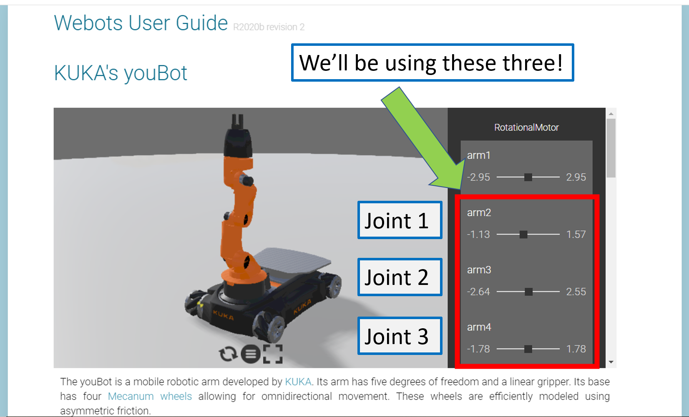

<!--Comment: Above here is the header, we need this to generate the web page-->

<!--Comment: This section is markdown-->

[](https://www.girlsintocoding.com/)

A project activity for [Girls Into Coding](https://www.girlsintocoding.com/) using a online version of the free open source [Webots](https://www.cyberbotics.com/) robot simulator.

This session is designed to be fun! The idea is that we can follow it together online, but that we can be free to move at our own pace. We're going to be doing some basic python programming in this activity. If you're not too familiar with Python, don't worry, you'll be able to follow along :) ! 

<!--Comment: End of markdown section-->

<!--Comment: This code here is html-->

<!--Comment: This is html paragraph spacing <br>-->
<br>
<br>

<!--Comment: This is html bootstrap-->
<div class="container p-3 my-3 bg-primary">
<h2>Contents</h2>
<ul class="list-group">
  <li class="list-group-item"><a href="#resourcesPanel">Resources</a></li>
  <li class="list-group-item"><a href="#Activity1">Pick and place example code</a></li>
</ul>
</div>

<div id="resourcesPanel" class="container p-3 my-3 bg-info">
<h2>Resources</h2> 
  <p>Here's some resources that may help with the activity</p>
<ul class="list-group">
  <a href="https://www.w3schools.com/python/" target="_blank" class="list-group-item list-group-item-action">Python tutorials at W3 Schools</a>
  <a href="https://www.pythoncheatsheet.org/" target="_blank" class="list-group-item list-group-item-action">Python cheatsheet</a>
  <a href="https://www.cyberbotics.com/doc/reference/index" target="_blank" class="list-group-item list-group-item-action">Webots documentation</a>
  <a href="https://robohub.org/30-women-in-robotics-you-need-to-know-about-2019/" target="_blank" class="list-group-item list-group-item-action">30 women in robotics you need to know about – 2019</a>
</ul>
</div>

<div id="sessionLinkPanel" class="container p-3 my-3 bg-warning">
<h2>Actvity series</h2> 
  <p>This activity session is part of a series on simulating robots, you can see links to all the activities in this series below!</p>
<ul class="list-group">
  <a href="https://meisben.github.io/girlsIntoCoding-robotbenchmark-activity/" target="_blank" class="list-group-item list-group-item-action"><b>Activity session 1:</b> Intro to robot simulation</a>
  <a href="https://meisben.github.io/girlsIntoCoding-robotbenchmark-activity2/" target="_blank" class="list-group-item list-group-item-action"><b>Activity session 2:</b> Pick and place with a robot arm</a>
</ul>
</div>

<!--Comment: This is the end of html bootstrap-->


<!--Comment: Paragrpah spacing-->
<br>
<br>

# What is Kinematics?
<br>

You might be wondering, what in the world is 'kinematics'? 

Well, it's just a fancy name we give to the **study of movement**. 

Cars move, cats move, humans move, and of course, robots move. We use kinematics to not only figure out where we will end up once we're done moving, but also to figure out how we need to move to get somewhere. Scientists have been using kinematics for a long time to figure out how things roll, bounce, fly, walk, anything you can think of that involves moving!

<br>

## But what does it have to do with robots?

<br>

When you want to make a robot move, you want to make sure it will get to where you want it to go. It's a little bit like Google Maps, but just for your robot.

Let me give you an example:

I'm going out for a walk. I go out of my house, walk down the road, turn right, and go to the end of the road.

**But where am I going??!?**

I'm controlling where I turn and how far I walk, but I don't actually know where I will end up. **Forward Kinematics** will help me figure out where I will end up if I take these turns and where I will be from where I started.

As you can see, I end up at the park.

<!--Need to add figure-->


<br>

What if I want to get to the supermarket, but I don't know how? (You can see how this sounds a lot like Google Maps.)

I know where the supermarket is from where I am now, but I don't know which turns to take to get there, or how far to walk. **Inverse Kinematics** helps me figure out what turns I need to take to get where I want to go.

<br>

<!--Need to add figure-->


## Joints and Grids

I'm going to introduce some new terms!

When we work with certain robots, we like to talk about the **Joint Space** and the **Cartesian Space**. They're just two ways of describing where our robot is, or its **state**. I'll show you in a bit what these terms mean, but first I'll show you where Forward and Inverse Kinematics fits into all this. I'll come back to this diagram later and you'll understand it better.

<!--Insert diagram-->

Okay, let's get to the fun bit!

<br>
<br>


<!--Comment: This section is markdown again-->

# Let's get familiar with our mobile robot arm!
---

<!--Comment: End of markdown-->

<!--Comment: Back to html bootstrap -->

<div id="Activity1" class="container p-3 my-3 bg-primary text-primary">
<h2>Activity #1</h2>
</div>

<br>

<!--Comment: End of html bootstrap -->


<!--Comment: Back to markdown -->

* We'll be using the [robotbenchmark](https://robotbenchmark.net/) website. Today we're going to work with a Kuka Youbot arm!
* Click on the **Start** button next to the **Pick and place** activity
* Click on **Start programming this benchmark**
* Read the instructions in the top left hand corner of the screen. You can resize the instruction window by dragging its bottom corner.
* When you're ready to program the robot, right click on it, and select **Edit controller**

<br>

[](https://www.girlsintocoding.com/)

<br>

* A window will pop up with python code in it! This is how we program our virtual robot.
* Delete the code in the robot controller window
* Copy and paste the code from below into the robot controller window - this contains some useful examples and functions

<!--Comment: End of markdown -->

<br>

<div class="container">
  <button type="button" class="btn btn-success" data-toggle="collapse" data-target="#demo3">Resources</button>
  <div id="demo3" class="collapse">
      
      <p><mark>Python functions explanation at <a href="https://www.w3schools.com/python/python_functions.asp">W3 schools :)</a></mark></p>
    
  </div>
</div>

<br>


<div id="Python1" class="container p-3 my-3 bg-secondary text-secondary">
<h2>Python Code</h2>
</div>

```python
"""Sample base code controller for the pick and place girls into coding activity"""

#---------------------
# Python library imports
#---------------------

from controller import Robot

#---------------------
# Starting up the robot
#---------------------

# Create the Robot instance.
robot = Robot()

# Get the time step of the current world.
timestep = int(robot.getBasicTimeStep())

# Inizialize base motors.
wheels = []
wheels.append(robot.getMotor("wheel1"))
wheels.append(robot.getMotor("wheel2"))
wheels.append(robot.getMotor("wheel3"))
wheels.append(robot.getMotor("wheel4"))
for wheel in wheels:
    # Activate controlling the motors setting the velocity.
    # Otherwise by default the motor expects to be controlled in force or position,
    # and setVelocity will set the maximum motor velocity instead of the target velocity.
    wheel.setPosition(float('+inf'))

# Initialize arm motors.
armMotors = []
armMotors.append(robot.getMotor("arm1"))
armMotors.append(robot.getMotor("arm2"))
armMotors.append(robot.getMotor("arm3"))
armMotors.append(robot.getMotor("arm4"))
armMotors.append(robot.getMotor("arm5"))
# Set the maximum motor velocity.
armMotors[0].setVelocity(1)
armMotors[1].setVelocity(0.5)
armMotors[2].setVelocity(0.5)
armMotors[3].setVelocity(0.3)

# Initialize arm position sensors.
# These sensors can be used to get the current joint position and monitor the joint movements.
armPositionSensors = []
armPositionSensors.append(robot.getPositionSensor("arm1sensor"))
armPositionSensors.append(robot.getPositionSensor("arm2sensor"))
armPositionSensors.append(robot.getPositionSensor("arm3sensor"))
armPositionSensors.append(robot.getPositionSensor("arm4sensor"))
armPositionSensors.append(robot.getPositionSensor("arm5sensor"))
for sensor in armPositionSensors:
    sensor.enable(timestep)

# Initialize gripper motors.
finger1 = robot.getMotor("finger1")
finger2 = robot.getMotor("finger2")
# Set the maximum motor velocity.
finger1.setVelocity(0.03)
finger2.setVelocity(0.03)
# Read the miminum and maximum position of the gripper motors.
fingerMinPosition = finger1.getMinPosition()
fingerMaxPosition = finger1.getMaxPosition()


#---------------------
# Helpful functions for controlling the robot (for the girls into coding activity)
#---------------------

def stopRobotWheels():
    for wheel in wheels:
        wheel.setVelocity(0.0)

def moveForward(mySpeed, timeDuration):
    """
    Purpose: move the robot forward
    Notes: mySpeed -> can take values from 1-9
    """
    for wheel in wheels:
        wheel.setVelocity(mySpeed)
    # Wait until the robot completes the timeDuration for the movement
    robot.step(timeDuration)
    stopRobotWheels()

def moveBackward(mySpeed, timeDuration):
    """
    Purpose: move the robot backward
    Notes: mySpeed -> can take values from 1-9
    """
    for wheel in wheels:
        wheel.setVelocity(-mySpeed)
    # Wait until the robot completes the timeDuration for the movement
    robot.step(timeDuration)
    stopRobotWheels()

def turnLeft(mySpeed, timeDuration):
    """
    Purpose: turn the robot left
    Notes: mySpeed -> can take values from 1-9
    """
    wheels[0].setVelocity(mySpeed)
    wheels[1].setVelocity(-mySpeed)
    wheels[2].setVelocity(mySpeed)
    wheels[3].setVelocity(-mySpeed)
    # Wait until the robot completes the timeDuration for the movement
    robot.step(timeDuration)
    stopRobotWheels()
    
def turnRight(mySpeed, timeDuration):
    """
    Purpose: turn the robot right
    Notes: mySpeed -> can take values from 1-9
    """
    wheels[0].setVelocity(-mySpeed)
    wheels[1].setVelocity(mySpeed)
    wheels[2].setVelocity(-mySpeed)
    wheels[3].setVelocity(mySpeed)
    # Wait until the robot completes the timeDuration for the movement
    robot.step(timeDuration)
    stopRobotWheels()
    


#---------------------
# Enter your code below here for the girls into coding exercise to run the robot ! ! 
#---------------------

moveForward(4, 5000)
stopRobotWheels()
turnRight(4, 5000)

```
<br>

Give it a go and see what you can make the robot do with these functions!

<br>
<br>

# Let's try moving in the Joint Space!

<div id="Activity2" class="container p-3 my-3 bg-primary text-primary">
<h2>Activity #2</h2>
</div>

<br>

When we talk about **Joint Space**, we are describing what each joint of the robot is doing. Joints are places where the robot can move, and usually connect two rigid bodies. We use **joints** and **links** to try and simplify the mathematics we need to do.

A good example of this is our own human arm! If I were to make a very simple drawing of how my arm moves, I'd have a shoulder joint, an elbow joint, and a wrist joint. The bones in between are links.

<!--Insert figure here-->

In this activity, we're going to focus on just the arm of the robot and make it touch the box! If you observe the arm of the robot, it uses **revolute joints**. These are joints that only rotate, a bit like like the hinges in your room door! 

The documentation for the Kuka Youbot will help you understand what it is we will be controlling. Click on the following picture to get to the website:

<br>

[](https://www.cyberbotics.com/doc/guide/youbot)

<br> 

Have a play around with it, then we can crack on! To start operating this robot arm in joint space:

* Delete the code in the controller window
* Copy and paste the following code into the robot controller


```python
"""Sample base code controller for the pick and place girls into coding activity"""

#---------------------
# Python library imports
#---------------------

from controller import Robot

#---------------------
# Starting up the robot
#---------------------

# Create the Robot instance.
robot = Robot()

# Get the time step of the current world.
timestep = int(robot.getBasicTimeStep())

# Inizialize base motors.
wheels = []
wheels.append(robot.getMotor("wheel1"))
wheels.append(robot.getMotor("wheel2"))
wheels.append(robot.getMotor("wheel3"))
wheels.append(robot.getMotor("wheel4"))
for wheel in wheels:
    # Activate controlling the motors setting the velocity.
    # Otherwise by default the motor expects to be controlled in force or position,
    # and setVelocity will set the maximum motor velocity instead of the target velocity.
    wheel.setPosition(float('+inf'))

# Initialize arm motors.
armMotors = []
armMotors.append(robot.getMotor("arm1"))
armMotors.append(robot.getMotor("arm2"))
armMotors.append(robot.getMotor("arm3"))
armMotors.append(robot.getMotor("arm4"))
armMotors.append(robot.getMotor("arm5"))
# Set the maximum motor velocity.
armMotors[0].setVelocity(1)
armMotors[1].setVelocity(0.5)
armMotors[2].setVelocity(0.5)
armMotors[3].setVelocity(0.3)

# Initialize arm position sensors.
# These sensors can be used to get the current joint position and monitor the joint movements.
armPositionSensors = []
armPositionSensors.append(robot.getPositionSensor("arm1sensor"))
armPositionSensors.append(robot.getPositionSensor("arm2sensor"))
armPositionSensors.append(robot.getPositionSensor("arm3sensor"))
armPositionSensors.append(robot.getPositionSensor("arm4sensor"))
armPositionSensors.append(robot.getPositionSensor("arm5sensor"))
for sensor in armPositionSensors:
    sensor.enable(timestep)

# Initialize gripper motors.
finger1 = robot.getMotor("finger1")
finger2 = robot.getMotor("finger2")
# Set the maximum motor velocity.
finger1.setVelocity(0.03)
finger2.setVelocity(0.03)
# Read the miminum and maximum position of the gripper motors.
fingerMinPosition = finger1.getMinPosition()
fingerMaxPosition = finger1.getMaxPosition()


#---------------------
# Helpful functions for controling the robot (for the girls into coding activity)
#---------------------

def stopRobotWheels():
    for wheel in wheels:
        wheel.setVelocity(0.0)
    
def turntoTrolley():
    """
    Purpose: For robot kinematics demo, to turn robot towards trolley
    """
    wheels[0].setVelocity(8.5)
    wheels[1].setVelocity(-4.5)
    wheels[2].setVelocity(8.5)
    wheels[3].setVelocity(-4.5)
    # Wait for a fixed amount to step that the robot rotates.
    robot.step(150 * timestep)
    stopRobotWheels()
    
    
def kinem_moveJoint(jt_num, postn):
    """
    Purpose: To move the joint given by jt_num to the given position, postn.
    Notes: There are joint maximums and minimums, will include error handling
    """
    if jt_num == 1:
        if postn > 1.57 or postn <-1.13:
            # the position is out of range, I'll let you know!
            print("Joint 1 value is out of range, please give a value between -1.13 and 1.57.")
        else:
            # Move arm
            armMotors[1].setPosition(postn) # Range is -1.13 to 1.57
            print("Moving Joint 1 to {}".format(postn)) # So you know what the controller is doing!
            
            # This code helps to run the simulator until the joint is in the position you told it to go to.
            while robot.step(timestep) != -1:
                if abs(armPositionSensors[1].getValue() - (postn)) < 0.01:
                # Motion completed.
                    break
            
    elif jt_num == 2:
        if postn > 2.55 or postn <-2.64:
            # the position is out of range, I'll let you know!
            print("Joint 2 value is out of range, please give a value between -2.64 and 2.55.")
        else:
            # Move arm
            armMotors[2].setPosition(postn) # Range is -2.64 to 2.55
            print("Moving Joint 2 to {}".format(postn)) # So you know what the controller is doing!
            
            # This code helps to run the simulator until the joint is in the position you told it to go to.
            while robot.step(timestep) != -1:
                if abs(armPositionSensors[2].getValue() - (postn)) < 0.01:
                # Motion completed.
                    break
            
    elif jt_num == 3:
        if postn > 1.78 or postn <-1.78:
            # the position is out of range, I'll let you know!
            print("Joint 3 value is out of range, please give a value between -1.78 and 1.78.")
        else:
            # Move arm
            armMotors[3].setPosition(postn) # Range is -1.78 to 1.78
            print("Moving Joint 3 to {}".format(postn)) # So you know what the controller is doing!
            
            # This code helps to run the simulator until the joint is in the position you told it to go to.
            while robot.step(timestep) != -1:
                if abs(armPositionSensors[3].getValue() - (postn)) < 0.01:
                # Motion completed.
                    break
            
    else:
        # For this exercise, we just want to use joints 1, 2, and 3. If you want to use the other joints,
        # take a look at the original example code given by robot benchmark!
        print("You can only use Joints 1, 2, and 3 for this exercise.")
    


#---------------------
# Enter your code below here for the girls into coding exercise to run the robot ! ! 
#---------------------

# Fill in the positions here!
Joint_1_postn = -1.0   # -1.13 to 1.57
Joint_2_postn = -0.6   # -2.64 to 2.55
Joint_3_postn = -0.75  # -1.78 to 1.78


# The following code will execute the action. Try and touch the box!
turntoTrolley()
kinem_moveJoint(1, Joint_1_postn) 
kinem_moveJoint(2, Joint_2_postn) 
kinem_moveJoint(3, Joint_3_postn) 


```

What do you think? 
* Is it difficult to figure out how far to move the robot?
* How many tries did you take to touch the box?
* What about touching the trolley?
* What do you think will happen if the base of the robot moves?

<br>
<br>


# What about Cartesian Space?

<div id="Activity3" class="container p-3 my-3 bg-primary text-primary">
<h2>Activity #3</h2>
</div>

<br>

  
```python
"""Sample base code controller for the pick and place girls into coding activity"""

#---------------------
# Python library imports
#---------------------

from controller import Robot
from math import cos, sin, atan2, sqrt, acos, pi

#---------------------
# Starting up the robot
#---------------------

# Create the Robot instance.
robot = Robot()

# Get the time step of the current world.
timestep = int(robot.getBasicTimeStep())

# Inizialize base motors.
wheels = []
wheels.append(robot.getMotor("wheel1"))
wheels.append(robot.getMotor("wheel2"))
wheels.append(robot.getMotor("wheel3"))
wheels.append(robot.getMotor("wheel4"))
for wheel in wheels:
    # Activate controlling the motors setting the velocity.
    # Otherwise by default the motor expects to be controlled in force or position,
    # and setVelocity will set the maximum motor velocity instead of the target velocity.
    wheel.setPosition(float('+inf'))

# Initialize arm motors.
armMotors = []
armMotors.append(robot.getMotor("arm1"))
armMotors.append(robot.getMotor("arm2"))
armMotors.append(robot.getMotor("arm3"))
armMotors.append(robot.getMotor("arm4"))
armMotors.append(robot.getMotor("arm5"))
# Set the maximum motor velocity.
armMotors[0].setVelocity(1)
armMotors[1].setVelocity(0.5)
armMotors[2].setVelocity(0.5)
armMotors[3].setVelocity(0.3)

# Initialize arm position sensors.
# These sensors can be used to get the current joint position and monitor the joint movements.
armPositionSensors = []
armPositionSensors.append(robot.getPositionSensor("arm1sensor"))
armPositionSensors.append(robot.getPositionSensor("arm2sensor"))
armPositionSensors.append(robot.getPositionSensor("arm3sensor"))
armPositionSensors.append(robot.getPositionSensor("arm4sensor"))
armPositionSensors.append(robot.getPositionSensor("arm5sensor"))
for sensor in armPositionSensors:
    sensor.enable(timestep)

# Initialize gripper motors.
finger1 = robot.getMotor("finger1")
finger2 = robot.getMotor("finger2")
# Set the maximum motor velocity.
finger1.setVelocity(0.03)
finger2.setVelocity(0.03)
# Read the miminum and maximum position of the gripper motors.
fingerMinPosition = finger1.getMinPosition()
fingerMaxPosition = finger1.getMaxPosition()


#---------------------
# Helpful functions for controling the robot (for the girls into coding activity)
#---------------------

def stopRobotWheels():
    for wheel in wheels:
        wheel.setVelocity(0.0)

def moveForward(mySpeed, timeDuration):
    """
    Purpose: move the robot forward
    Notes: mySpeed -> can take values from 1-9
    """
    for wheel in wheels:
        wheel.setVelocity(mySpeed)
    # Wait until the robot completes the timeDuration for the movement
    robot.step(timeDuration)
    stopRobotWheels()

def moveBackward(mySpeed, timeDuration):
    """
    Purpose: move the robot backward
    Notes: mySpeed -> can take values from 1-9
    """
    for wheel in wheels:
        wheel.setVelocity(-mySpeed)
    # Wait until the robot completes the timeDuration for the movement
    robot.step(timeDuration)
    stopRobotWheels()

def turnLeft(mySpeed, timeDuration):
    """
    Purpose: turn the robot left
    Notes: mySpeed -> can take values from 1-9
    """
    wheels[0].setVelocity(mySpeed)
    wheels[1].setVelocity(-mySpeed)
    wheels[2].setVelocity(mySpeed)
    wheels[3].setVelocity(-mySpeed)
    # Wait until the robot completes the timeDuration for the movement
    robot.step(timeDuration)
    stopRobotWheels()
    
def turnRight(mySpeed, timeDuration):
    """
    Purpose: turn the robot right
    Notes: mySpeed -> can take values from 1-9
    """
    wheels[0].setVelocity(-mySpeed)
    wheels[1].setVelocity(mySpeed)
    wheels[2].setVelocity(-mySpeed)
    wheels[3].setVelocity(mySpeed)
    # Wait until the robot completes the timeDuration for the movement
    robot.step(timeDuration)
    stopRobotWheels()
    
def turntoTrolley():
    """
    Purpose: For robot kinematics demo, to turn robot towards trolley
    """
    wheels[0].setVelocity(8.5)
    wheels[1].setVelocity(-4.5)
    wheels[2].setVelocity(8.5)
    wheels[3].setVelocity(-4.5)
    # Wait for a fixed amount to step that the robot rotates.
    robot.step(150 * timestep)
    stopRobotWheels()
    
    
def kinem_moveJoint(jt_num, postn):
    """
    Purpose: To move the joint given by jt_num to the given position, postn.
    Notes: There are joint maximums and minimums, will include error handling
    """
    if jt_num == 1:
        if postn > 1.57 or postn <-1.13:
            # the position is out of range, I'll let you know!
            print("Joint 1 value is out of range, please give a value between -1.13 and 1.57.")
        else:
            # Move arm
            armMotors[1].setPosition(postn) # Range is -1.13 to 1.57
            print("Moving Joint 1 to {}".format(postn)) # So you know what the controller is doing!
            
            # This code helps to run the simulator until the joint is in the position you told it to go to.
            while robot.step(timestep) != -1:
                if abs(armPositionSensors[1].getValue() - (postn)) < 0.01:
                # Motion completed.
                    break
            
    elif jt_num == 2:
        if postn > 2.55 or postn <-2.64:
            # the position is out of range, I'll let you know!
            print("Joint 2 value is out of range, please give a value between -2.64 and 2.55.")
        else:
            # Move arm
            armMotors[2].setPosition(postn) # Range is -2.64 to 2.55
            print("Moving Joint 2 to {}".format(postn)) # So you know what the controller is doing!
            
            # This code helps to run the simulator until the joint is in the position you told it to go to.
            while robot.step(timestep) != -1:
                if abs(armPositionSensors[2].getValue() - (postn)) < 0.01:
                # Motion completed.
                    break
            
    elif jt_num == 3:
        if postn > 1.78 or postn <-1.78:
            # the position is out of range, I'll let you know!
            print("Joint 3 value is out of range, please give a value between -1.78 and 1.78.")
        else:
            # Move arm
            armMotors[3].setPosition(postn) # Range is -1.78 to 1.78
            print("Moving Joint 3 to {}".format(postn)) # So you know what the controller is doing!
            
            # This code helps to run the simulator until the joint is in the position you told it to go to.
            while robot.step(timestep) != -1:
                if abs(armPositionSensors[3].getValue() - (postn)) < 0.01:
                # Motion completed.
                    break
            
    else:
        # For this exercise, we just want to use joints 1, 2, and 3. If you want to use the other joints,
        # take a look at the original example code given by robot benchmark!
        print("You can only use Joints 1, 2, and 3 for this exercise.")
    
def Cartesian_to_Joint(x, y, phi):
    """
    Purpose: To calculate the joint angles needed to get to point given by x, y, and phi
    """
    # The lengths of the links
    l1 = 0.155
    l2 = 0.135
    l3 = 0.218
    
    # A whole lot of complicated math!
    big_X = x - (l3*cos(phi))
    big_Y = y - (l3*sin(phi))

    denom1 = sqrt(big_X**2 + big_Y**2)
    gamma = atan2((-big_Y/denom1), (-big_X/denom1))

    denom2 = 2*l1*(sqrt(big_X**2 + big_Y**2))

    q1_A = gamma + acos(-(big_X**2 + big_Y**2 + l1**2 - l2**2)/denom2)
    q1_B = gamma - acos(-(big_X**2 + big_Y**2 + l1**2 - l2**2)/denom2)

    if q1_A < q1_B:
        q1 = q1_A
    else:
        q1 = q1_B

    q2 = atan2(((big_Y - (l1*sin(q1)))/l2), ((big_X - (l1*cos(q1)))/l2)) - q1
    q3 = phi - q1 - q2

    # Just to make sure the outputs come out right!
    if q1 > pi:
        q1 = q1 - (2*pi)
    elif q1 < -pi:
        q1 = (2*pi) + q1

    if q2 > pi:
        q2 = q2 - (2*pi)
    elif q2 < -pi:
        q2 = (2*pi) + q2

    if q3 > pi:
        q3 = q3 - (2*pi)
    elif q3 < -pi:
        q3 = (2*pi) + q3
      
    # Telling the joints to go to the positions we calculated
    kinem_moveJoint(1, q1)
    kinem_moveJoint(2, q2)
    kinem_moveJoint(3, q3)

    # Giving information back
    return [q1, q2, q3]


#---------------------
# Enter your code below here for the girls into coding exercise to run the robot ! ! 
#---------------------


turntoTrolley()
#kinem_moveJoint(1, -1.0) # -1.13 to 1.57
#kinem_moveJoint(2, -0.6) # -2.64 to 2.55
#kinem_moveJoint(3, -0.75) # -1.78 to 1.78

#Cartesian_to_Joint(-0.07, -0.42, -2.35)
Cartesian_to_Joint(0.1, -0.2, -1.8)

```
