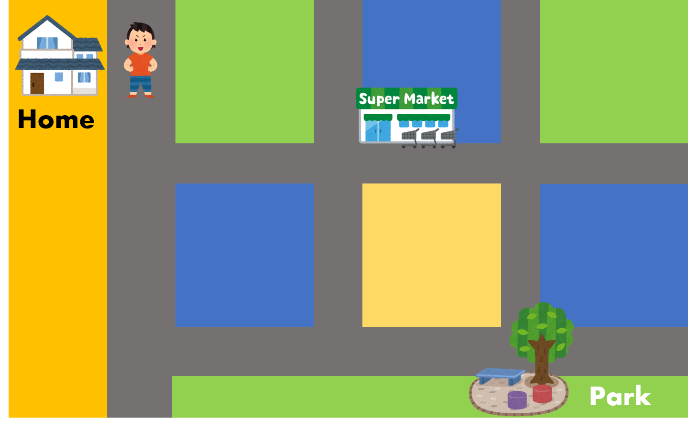
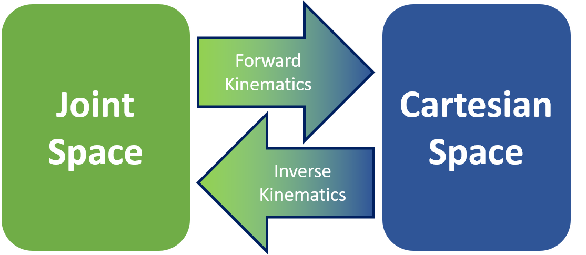
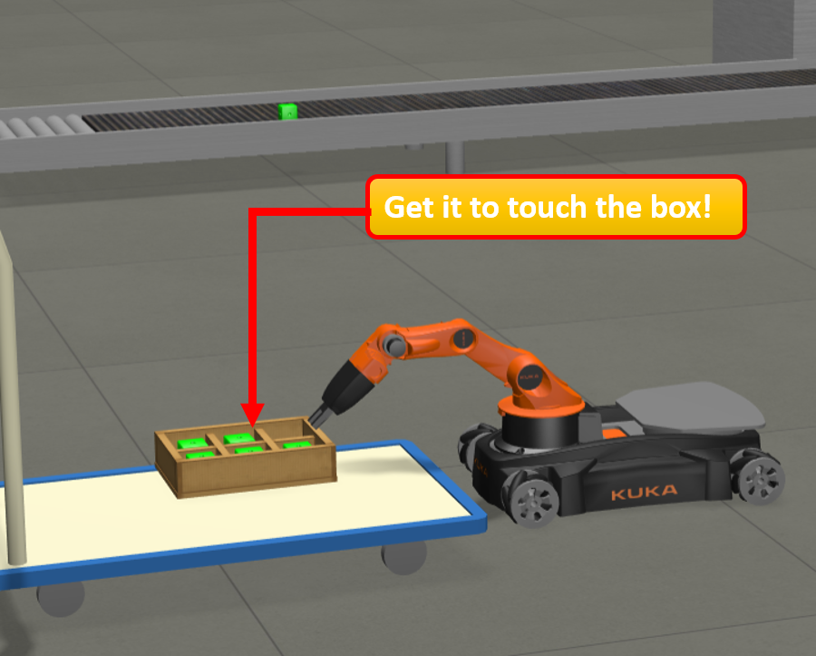
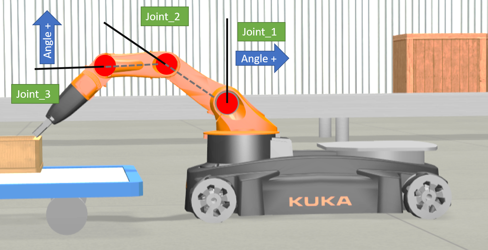
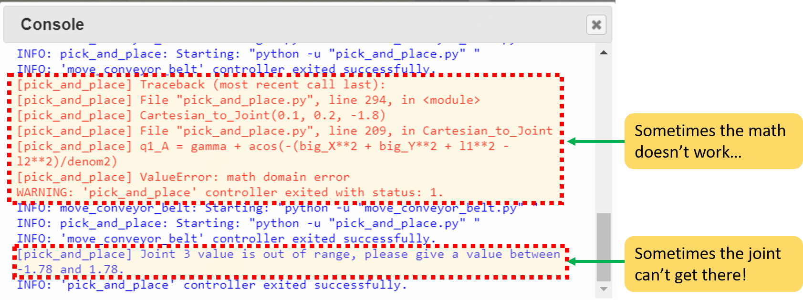
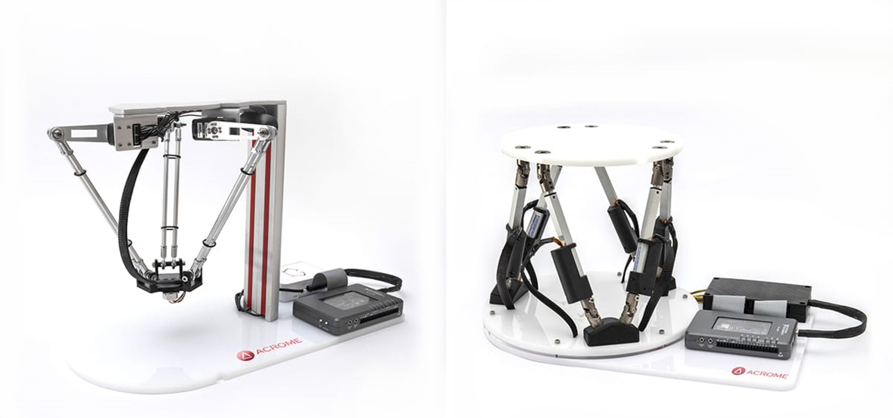
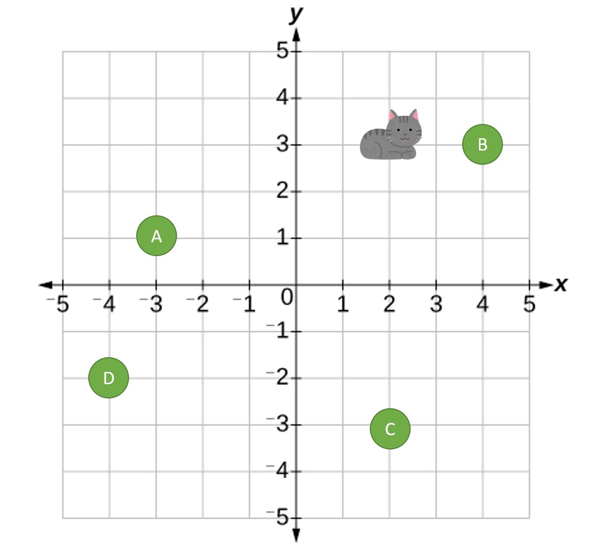
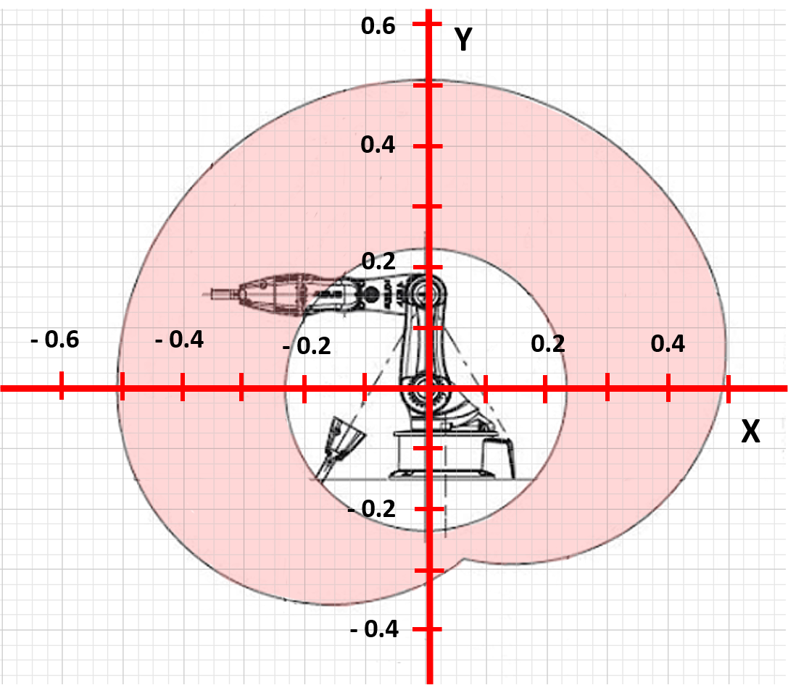
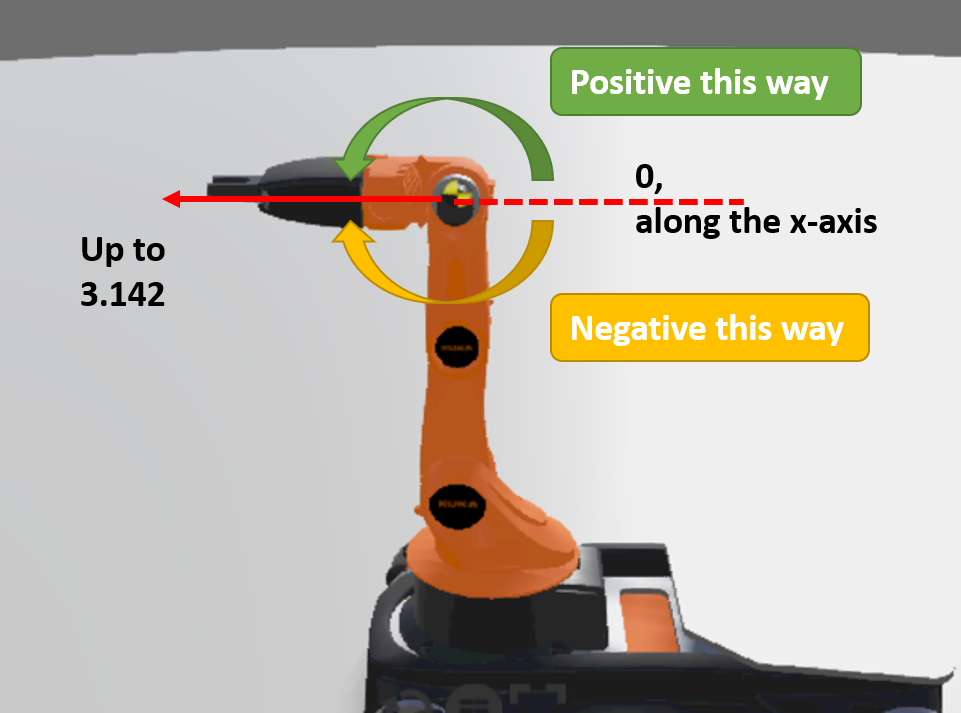
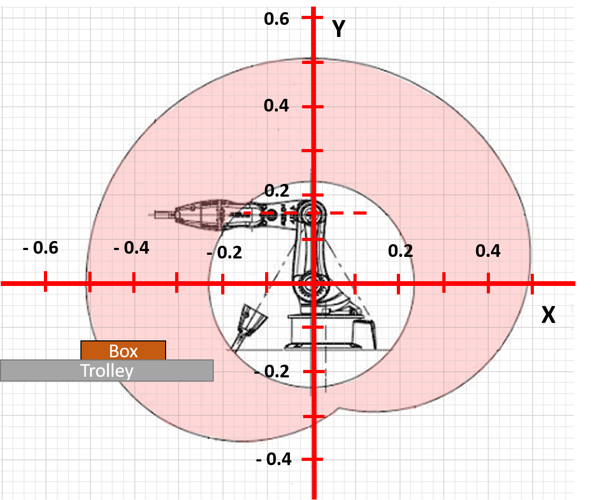

<!--Comment: Above here is the header, we need this to generate the web page-->

<!--Comment: This section is markdown inside a bootstrap container-->

[](https://www.girlsintocoding.com/)

A project activity for [Girls Into Coding](https://www.girlsintocoding.com/).

This session is designed to be fun! The idea is that we can follow it together online, but that we can be free to move at our own pace. We're going to be doing some basic python programming in this activity. If you're not too familiar with Python, don't worry, you'll be able to follow along :) ! 


<!--Comment: End of markdown section-->

<!--Comment: This code here is html-->

<!--Comment: This is html paragraph spacing <br>-->
<br>
<br>

<!--Comment: This is html bootstrap-->
<div class="container p-3 my-3 bg-primary">
<h2>Contents</h2>
<ul class="list-group">
  <li class="list-group-item"><a href="#resourcesPanel">Resources</a></li>
  <li class="list-group-item"><a href="#Activity1">Getting familiar with the robot arm simulator</a></li>
  <li class="list-group-item"><a href="#Activity2">Controlling your robot in Joint Space</a></li>
  <li class="list-group-item"><a href="#Activity3">Controlling your robot in Cartesian Space</a></li>
</ul>
</div>

<div id="resourcesPanel" class="container p-3 my-3 bg-info">
<h2>Resources</h2> 
  <p>Here's some resources that may help with the activity</p>
<ul class="list-group">
  <a href="https://www.w3schools.com/python/" target="_blank" class="list-group-item list-group-item-action">Python tutorials at W3 Schools</a>
  <a href="https://www.pythoncheatsheet.org/" target="_blank" class="list-group-item list-group-item-action">Python cheatsheet</a>
  <a href="https://robohub.org/30-women-in-robotics-you-need-to-know-about-2019/" target="_blank" class="list-group-item list-group-item-action">30 women in robotics you need to know about – 2019</a>
</ul>
</div>

<div id="sessionLinkPanel" class="container p-3 my-3 bg-warning">
<h2>Actvity series</h2> 
  <p>This activity session is part of a series on simulating robots, you can see links to all the activities in this series below!</p>
<ul class="list-group">
  <a href="https://meisben.github.io/girlsIntoCoding-robotbenchmark-activity/" target="_blank" class="list-group-item list-group-item-action"><b>Activity session 1:</b> Intro to robot simulation</a>
  <a href="https://meisben.github.io/girlsIntoCoding-robotbenchmark-activity2/" target="_blank" class="list-group-item list-group-item-action"><b>Activity session 2:</b> Pick and place with a robot arm</a>
</ul>
</div>

<!--Comment: This is the end of html bootstrap-->


<!--Comment: Paragrpah spacing-->
<br>
<br>

# What is Kinematics?
<br>

You might be wondering, what in the world is 'kinematics'? 

Well, it's just a fancy name we give to the **study of movement**. 

<div class="container py-1" style="background-color:#e1f0f1;">

Cars move, cats move, humans move, and of course, robots move. We use kinematics to not only figure out where we will end up once we're done moving, but also to figure out how we need to move to get somewhere. Scientists have been using kinematics for a long time to figure out how things roll, bounce, fly, walk, anything you can think of that involves moving!

</div>

<br>

## But what does it have to do with robots?

<br>

When you want to make a robot move, you want to make sure it will get to where you want it to go. It's a little bit like Google Maps, but just for your robot.

Let me give you an example:

I'm going out for a walk. I go out of my house, walk down the road, take the second left, and keep walking for two blocks.

**But where am I going??!?**

I'm controlling where I turn and how far I walk, but I don't actually know where I will end up. **Forward Kinematics** will help me figure out where I will end up if I take these turns and where I will be from where I started.

As you can see, I end up at the park.

<br>


*Cartoons Copyright of [Irasutoya](https://www.irasutoya.com)*

<br>

What if I want to get to the supermarket, but I don't know how? (You can see how this sounds a lot like Google Maps.)

I know where the supermarket is from where I am now, but I don't know which turns to take to get there, or how far to walk. **Inverse Kinematics** helps me figure out what turns I need to take to get where I want to go.

<br>
<br>

## Joints and Grids

I'm going to introduce some new terms!

When we work with certain robots, we like to talk about the **Joint Space** and the **Cartesian Space**. They're just two ways of describing where our robot is, or its **state**. I'll show you in a bit what these terms mean, but first I'll show you where Forward and Inverse Kinematics fits into all this. I'll come back to this diagram later and you'll understand it better.

<br>



<br>

Okay, let's get to the fun bit!

<br>
<br>


<!--Comment: This section is markdown again-->

# Let's build our robot arm!
---

<!--Comment: End of markdown-->

<!--Comment: Back to html bootstrap -->

<div id="Activity1" class="container p-3 my-3 bg-primary text-primary">
<h2>Activity #1</h2>
</div>

<br>

<!--Comment: End of html bootstrap -->

## Robot Arm Assembly - A little journey through mechanical design

<!--Comment: Back to markdown -->

First, we need to build our robot arm. You should have the following items:

<!-- Photo of all the parts-->


<!-- Insert assembly from Ben -->

Now you've got the arm assembled! Take the mat provided and place the base of the arm in the box. Use the blu-tack we've provided. You might want to use some blu-tack to keep the mat in place too.

Uncap the whiteboard marker and put it in the 2nd arm and adjust the height, then tighten the bolt so that it stays in place.

## Uploading the code and how to use it


<br>
<br>


# Let's try moving in the Joint Space!

<div id="Activity2" class="container p-3 my-3 bg-primary text-primary">
<h2>Activity #2</h2>
</div>

<br>

When we talk about **Joint Space**, we are describing what each joint of the robot is doing. Joints are places where the robot can move, and usually connect two rigid bodies. We use **joints** and **links** to try and simplify the mathematics we need to do.

A good example of this is our own human arm! If I were to make a very simple drawing of how my arm moves, I'd have a shoulder joint, an elbow joint, and a wrist joint. The bones in between are links.

<br>


<br>

In this activity, we're going to try and make the pen touch the flower! If you observe our robot arm, it uses **revolute joints**. These are joints that only rotate, a bit like like the hinges in your room door! 

<br>



<br>

We've made a little animation that you can use to try and understand what it means to control the robot in joint space. 

<br>

<!-- add Ben's animation -->

<br> 

Have a play around with it, and see if you can understand what values you can give the robot, and what it will make the robot do!

The values given in those bars are the angles that the joints can reach. The picture below might help you understand what the values mean. The black lines indicate where 'zero' is for that joint, and I've put down the direction that are positive values.

<br>

 <!-- Have to replace this -->

<br>


To start operating the arm robot arm in joint space:

* Delete the code in the controller window
* Copy and paste the code in the window below into the robot controller
* Try and figure out what values of **Joint_1_postn**, **Joint_2_postn**, and **Joint_3_postn** you can put in to get the robot to touch the box! 
* If you put in values outside of the joint ranges (I've put them next to the variables), you will get an error like below in the console. 



Reset the simulation and try again with values within the ranges!

<br>

### Python Code
```python


```
<br>

What do you think? 
* Is it difficult to figure out how far to move the robot?
* How many tries did you take to touch the flower?
* What do you think will happen if the base of the robot moves?


<br>
<br>


# What about Cartesian Space?

<div id="Activity3" class="container p-3 my-3 bg-primary text-primary">
<h2>Activity #3</h2>
</div>

<br>

After playing about with the **Joint Space**, maybe you're thinking "oh, that's not so bad", or maybe you had to take lots of tries to get it to touch the flower. Now just imagine if you had a robot with *lots more joints*! Like *twenty*. What about robots like these?


*Images Copyright [Acrome Robotics](https://acrome.net/)*

<br>

That's a lot of joints you'd have to control, just because you want to touch something with the end of the robot!

Now I'm going to introduce you to **Cartesian Space**. You might have heard of things like **coordinates**. Coordinates are a way of talking about the position of things, and Cartesian is a system of coordinates. If you know maps, you'll have heard of longitude and latitude, it's a bit like that.

The **Cartesian coordinate system** in 2-dimensions (a flat surface!) uses 2 axes: x and y to describe where a point is on that plane. For example, in the image below the cat is at x = 2 and y = 3. Or we can write it as (2, 3) with brackets. So if I told you to put the cat at (2, -3), where would I put it?

<br>


*Cat Image Copyright of [Irasutoya](https://www.irasutoya.com)*

<br>

Okay, so now you have the idea. Here is an image of the robot and a grid over it, with **x** and **y** axis measurements. Any point within the pink area (also called the workspace) is a place the end of the robot can reach. Another variable I'd like to talk about is **phi**. This refers to the angle that the last link of the robot is pointing to, and I've also shown you in the figure below what it looks like and the values you can put in.

<br>



<br>



<br>

* Delete the code in the controller window
* Copy and paste the following code into the robot controller
* Try and figure out what values you can put in **x**, **y**, and **phi** to make the robot touch the box!
* If you put in values that the robot cannot reach, it will put out an error, same as before. Reset the simulation and try a different value!

<br>

### Python Code
  
```python
"""Sample base code controller for the pick and place girls into coding activity"""

#---------------------
# Python library imports
#---------------------

from controller import Robot
from math import cos, sin, atan2, sqrt, acos, pi

#---------------------
# Starting up the robot
#---------------------

# Create the Robot instance.
robot = Robot()

# Get the time step of the current world.
timestep = int(robot.getBasicTimeStep())

# Inizialize base motors.
wheels = []
wheels.append(robot.getMotor("wheel1"))
wheels.append(robot.getMotor("wheel2"))
wheels.append(robot.getMotor("wheel3"))
wheels.append(robot.getMotor("wheel4"))
for wheel in wheels:
    # Activate controlling the motors setting the velocity.
    # Otherwise by default the motor expects to be controlled in force or position,
    # and setVelocity will set the maximum motor velocity instead of the target velocity.
    wheel.setPosition(float('+inf'))

# Initialize arm motors.
armMotors = []
armMotors.append(robot.getMotor("arm1"))
armMotors.append(robot.getMotor("arm2"))
armMotors.append(robot.getMotor("arm3"))
armMotors.append(robot.getMotor("arm4"))
armMotors.append(robot.getMotor("arm5"))
# Set the maximum motor velocity.
armMotors[0].setVelocity(1)
armMotors[1].setVelocity(0.5)
armMotors[2].setVelocity(0.5)
armMotors[3].setVelocity(0.3)

# Initialize arm position sensors.
# These sensors can be used to get the current joint position and monitor the joint movements.
armPositionSensors = []
armPositionSensors.append(robot.getPositionSensor("arm1sensor"))
armPositionSensors.append(robot.getPositionSensor("arm2sensor"))
armPositionSensors.append(robot.getPositionSensor("arm3sensor"))
armPositionSensors.append(robot.getPositionSensor("arm4sensor"))
armPositionSensors.append(robot.getPositionSensor("arm5sensor"))
for sensor in armPositionSensors:
    sensor.enable(timestep)

# Initialize gripper motors.
finger1 = robot.getMotor("finger1")
finger2 = robot.getMotor("finger2")
# Set the maximum motor velocity.
finger1.setVelocity(0.03)
finger2.setVelocity(0.03)
# Read the miminum and maximum position of the gripper motors.
fingerMinPosition = finger1.getMinPosition()
fingerMaxPosition = finger1.getMaxPosition()


#---------------------
# Helpful functions for controling the robot (for the girls into coding activity)
#---------------------

def stopRobotWheels():
    for wheel in wheels:
        wheel.setVelocity(0.0)

def moveForward(mySpeed, timeDuration):
    """
    Purpose: move the robot forward
    Notes: mySpeed -> can take values from 1-9
    """
    for wheel in wheels:
        wheel.setVelocity(mySpeed)
    # Wait until the robot completes the timeDuration for the movement
    robot.step(timeDuration)
    stopRobotWheels()

def moveBackward(mySpeed, timeDuration):
    """
    Purpose: move the robot backward
    Notes: mySpeed -> can take values from 1-9
    """
    for wheel in wheels:
        wheel.setVelocity(-mySpeed)
    # Wait until the robot completes the timeDuration for the movement
    robot.step(timeDuration)
    stopRobotWheels()

def turnLeft(mySpeed, timeDuration):
    """
    Purpose: turn the robot left
    Notes: mySpeed -> can take values from 1-9
    """
    wheels[0].setVelocity(mySpeed)
    wheels[1].setVelocity(-mySpeed)
    wheels[2].setVelocity(mySpeed)
    wheels[3].setVelocity(-mySpeed)
    # Wait until the robot completes the timeDuration for the movement
    robot.step(timeDuration)
    stopRobotWheels()
    
def turnRight(mySpeed, timeDuration):
    """
    Purpose: turn the robot right
    Notes: mySpeed -> can take values from 1-9
    """
    wheels[0].setVelocity(-mySpeed)
    wheels[1].setVelocity(mySpeed)
    wheels[2].setVelocity(-mySpeed)
    wheels[3].setVelocity(mySpeed)
    # Wait until the robot completes the timeDuration for the movement
    robot.step(timeDuration)
    stopRobotWheels()
    
def turntoTrolley():
    """
    Purpose: For robot kinematics demo, to turn robot towards trolley
    """
    wheels[0].setVelocity(8.5)
    wheels[1].setVelocity(-4.5)
    wheels[2].setVelocity(8.5)
    wheels[3].setVelocity(-4.5)
    # Wait for a fixed amount to step that the robot rotates.
    robot.step(150 * timestep)
    stopRobotWheels()
    
    
def kinem_moveJoint(jt_num, postn):
    """
    Purpose: To move the joint given by jt_num to the given position, postn.
    Notes: There are joint maximums and minimums, will include error handling
    """
    if jt_num == 1:
        if postn > 1.57 or postn <-1.13:
            # the position is out of range, I'll let you know!
            print("Joint 1 value is out of range, please give a value between -1.13 and 1.57.")
        else:
            # Move arm
            armMotors[1].setPosition(postn) # Range is -1.13 to 1.57
            print("Moving Joint 1 to {}".format(postn)) # So you know what the controller is doing!
            
            # This code helps to run the simulator until the joint is in the position you told it to go to.
            while robot.step(timestep) != -1:
                if abs(armPositionSensors[1].getValue() - (postn)) < 0.01:
                # Motion completed.
                    break
            
    elif jt_num == 2:
        if postn > 2.55 or postn <-2.64:
            # the position is out of range, I'll let you know!
            print("Joint 2 value is out of range, please give a value between -2.64 and 2.55.")
        else:
            # Move arm
            armMotors[2].setPosition(postn) # Range is -2.64 to 2.55
            print("Moving Joint 2 to {}".format(postn)) # So you know what the controller is doing!
            
            # This code helps to run the simulator until the joint is in the position you told it to go to.
            while robot.step(timestep) != -1:
                if abs(armPositionSensors[2].getValue() - (postn)) < 0.01:
                # Motion completed.
                    break
            
    elif jt_num == 3:
        if postn > 1.78 or postn <-1.78:
            # the position is out of range, I'll let you know!
            print("Joint 3 value is out of range, please give a value between -1.78 and 1.78.")
        else:
            # Move arm
            armMotors[3].setPosition(postn) # Range is -1.78 to 1.78
            print("Moving Joint 3 to {}".format(postn)) # So you know what the controller is doing!
            
            # This code helps to run the simulator until the joint is in the position you told it to go to.
            while robot.step(timestep) != -1:
                if abs(armPositionSensors[3].getValue() - (postn)) < 0.01:
                # Motion completed.
                    break
            
    else:
        # For this exercise, we just want to use joints 1, 2, and 3. If you want to use the other joints,
        # take a look at the original example code given by robot benchmark!
        print("You can only use Joints 1, 2, and 3 for this exercise.")
    
def Cartesian_to_Joint(x, y, phi):
    """
    Purpose: To calculate the joint angles needed to get to point given by x, y, and phi
    """
    # The lengths of the links
    l1 = 0.155
    l2 = 0.135
    l3 = 0.218
    
    # A whole lot of complicated math!
    big_Y = y - (l3*cos(phi))
    big_X = x - (l3*sin(phi))

    denom1 = sqrt(big_Y**2 + big_X**2)
    gamma = atan2((-big_X/denom1), (-big_Y/denom1))

    denom2 = 2*l1*(sqrt(big_Y**2 + big_X**2))

    q1_A = gamma + acos(-(big_Y**2 + big_X**2 + l1**2 - l2**2)/denom2)
    q1_B = gamma - acos(-(big_Y**2 + big_X**2 + l1**2 - l2**2)/denom2)

    if q1_A < q1_B:
        q1 = q1_A
    else:
        q1 = q1_B

    q2 = atan2(((big_X - (l1*sin(q1)))/l2), ((big_Y - (l1*cos(q1)))/l2)) - q1
    q3 = phi - q1 - q2

    # Just to make sure the outputs come out right!
    if q1 > pi:
        q1 = q1 - (2*pi)
    elif q1 < -pi:
        q1 = (2*pi) + q1

    if q2 > pi:
        q2 = q2 - (2*pi)
    elif q2 < -pi:
        q2 = (2*pi) + q2

    if q3 > pi:
        q3 = q3 - (2*pi)
    elif q3 < -pi:
        q3 = (2*pi) + q3
      
    # Telling the joints to go to the positions we calculated
    kinem_moveJoint(1, q1)
    kinem_moveJoint(2, q2)
    kinem_moveJoint(3, q3)

    # Giving information back
    return [q1, q2, q3]


#---------------------
# Enter your code below here for the girls into coding exercise to run the robot ! ! 
#---------------------

# Change these values !!!!!!!!!!!

x = -0.1    # x-coordinate
y = -0.05  # y-coordinate
phi = -2.6 # angle of the end of the arm

# If you put in values that the robot can't get to, you'll see an error in the console!

# This code will make the robot move
turntoTrolley()
Cartesian_to_Joint(x, y, phi)

```

<br>


What do you think? Is it still really hard? What if I gave you this hint:

<div class="container">
  <button type="button" class="btn btn-info" data-toggle="collapse" data-target="#demo3">Hint</button>
  <div id="demo3" class="collapse">
    
    <p></p>   
   
  </div>
</div>

<br>

Does that make it a lot easier?

<br>
<br>

# So that chart we had before...

<br>


<br>

This is why we use kinematics. It can be hard to imagine in our heads what the end of the robot might do if we changed the position of a joint. **Forward Kinematics** can help us change our joint positions to **Cartesian space**, which can be a lot easier to visualise. If we know a point in **Cartesian space** we want to get to, we can use **Inverse Kinematics** to find the joint positions we need to give our robot.

This is a really simplified problem with a robot arm, but we use the same principles when we're trying to figure out where a car is, or even flying robots. We used **trigonometry** and **geometry** to do this. 

What else do you think this might be useful for?


